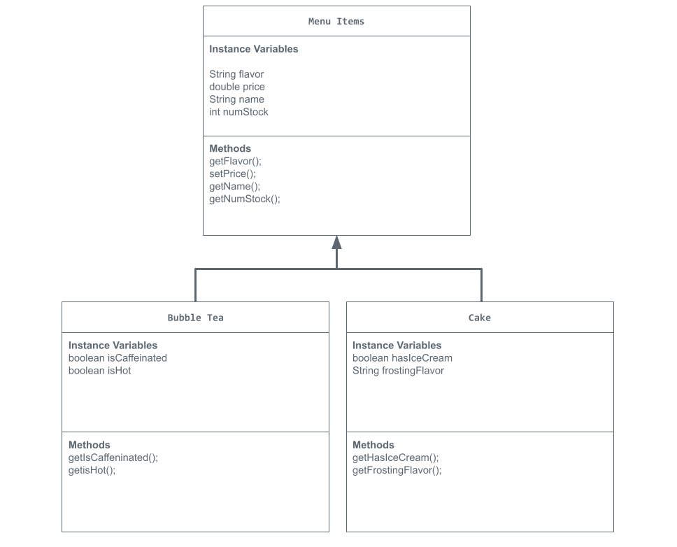

# Store-Management-Project
This project is based on a boba shop!
# Unit 2 - Store Management Project

## Introduction

You are opening a new business in your community! Businesses often need programs to manage the products and services they offer and track orders and requests from customers. Your goal is to create a store management system for your business.

## Requirements

Use your knowledge of object-oriented programming and class structure and design to create your store management system:
- **Create a class hierarchy** – Develop a superclass that represents a product or service your business offers and one or more subclasses that extend the superclass to represent more specific types of products or services.
- **Declare instance variables** – Declare instance variables in the superclass that are shared with the subclasses and instance variables in the subclasses that are not shared with the superclass.
- **Write constructors** – Write no-argument and parameterized constructors in the superclass and subclasses. Subclass constructors use the super keyword to call the superclass constructor.
- **Implement accessor and mutator methods** – Write accessor and mutator methods for instance variables that should be accessible and/or modifiable from outside of the class.
- **Implement a toString() method** – Write toString() methods in the superclass and subclasses that return information about the state of an object.

## UML Diagram

UML Diagram for my project! 

## Description

For my Store Management project I decided to create a boba shop. I created a Boba shop because I love going to boba shops with my family and friends. Boba is one of my favorite drinks and I love to spend time with loved ones while at boba shops. The overall superclass of my project is called Menu Items. The instance variables in the Menu Items superclass are flavor, price, name of the item, and how many of that item are in stock. Both the flavor and name of the item are Strings while the price is a double data type, and the number left in stock is an integer. There are two subclasses I made for this project. One subclass is called Bubble tea. The Bubble Tea subclass contains whether or not the bubble tea drink has caffeine and if the drink is hot or not. For my last subclass I chose to name it Cake. The instance variables in the Cake subclass contain whether or not it has ice cream and the flavor of the frosting. All of the instance variables are set to private and cannot be accessed in other classes unless we use methods. This process is called encapsulation. My project also contains a couple parameterized constructors and a few no-argument constructors. Lastly, my project contains multi-line comments to help explain what the methods are. 

